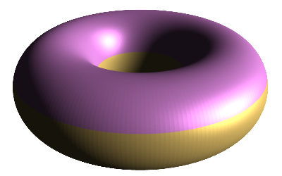
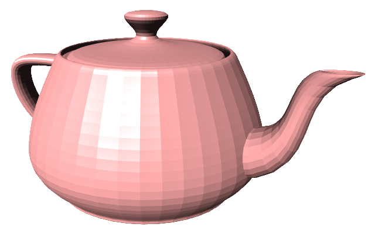

# Minimalistic JavaScript Renderer

[![Language grade: JavaScript][lgtm]](https://lgtm.com/projects/g/CaterpyOwO/mjsr/context:javascript)
[![Github Release][release]](https://github.com/CaterpyOwO/mjsr/releases/latest)
[![Github License][license]](https://github.com/CaterpyOwO/mjsr/blob/master/LICENSE)

[lgtm]: https://img.shields.io/lgtm/grade/javascript/g/CaterpyOwO/mjsr.svg?logo=lgtm&logoWidth=18
[license]: https://img.shields.io/github/license/CaterpyOwO/mjsr
[release]: https://img.shields.io/github/v/release/CaterpyOwO/mjsr

This is a minimalistic WebGL/Canvas2d 3d renderer.
Designed with simplicity in mind.

[Here](https://github.com/CaterpyOwO/mjsr/projects) is the project board where you can see the current development progress, planned features & more

## Usage

You can use it in your page by including this snippet

```html
<script src="https://cdn.jsdelivr.net/gh/caterpyowo/mjsr@v0.9.5-alpha/dist/mjsr.min.js"></script>
```

[Here](https://github.com/CaterpyOwO/mjsr/wiki) is a link to the wiki, where you can find the documentation

## Examples




See the [`examples`](examples) folder for examples of usage
